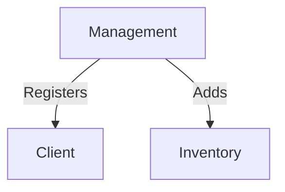
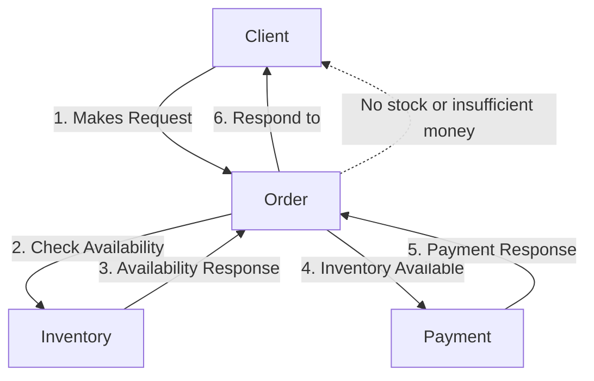

## WIP: gRPC Microservices with Spring Boot

A multi-service application where services communicate using gRPC.

Services:
1. Management
2. Inventory
3. Client
4. Order
5. Payment

## Getting started

1. Build the project `mvn clean install`
2. Run docker compose with env variable.

Windows example `set MANAGEMENT_SYSTEM_TOKEN=dev && docker compose up --build -d`

## Work flow

