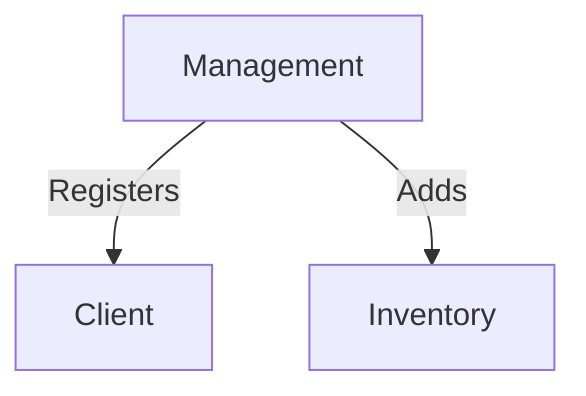
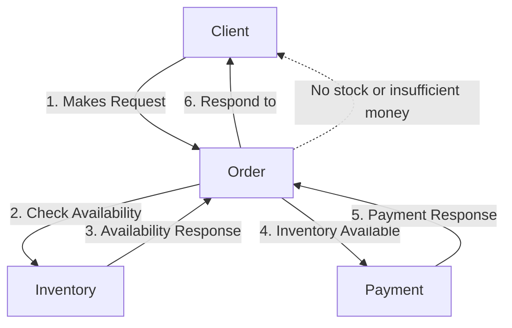

[](https://deepwiki.com/alekal1/grpc-microservice-commerce)

## WIP: gRPC Microservice Commerce Platform


A modular commerce platform built with Spring Boot,
gRPC and Protocol Buffers


## System Architecture

The system is composed of five core microservices:

* Management - Administrative and onboarding operations.
* Inventory - Stock levels and item availability.
* Client - Order start and top-up balance
* Order - Coordinates multi-step order workflow
* Payment - Processes and validates payments.

#### Helper modules

1. common-proto - For storing common proto files, that are in use across all application
2. coverage-report - One file module that collect test code coverage
3. credentials-api - For providing credential support for other modules

## Module Structure
Each module consist of two sub-modules:

* The gRPC API definitions (-api suffix)
* The service implementation (-impl suffix)

## Security & Authentification

* Each service communicates using **secret credentials** embedded in a 
base64-encoded metadata header.

* For example:
  1. When the **management module** makes an inventory request, it includes secret credentials in the request header.
  2. The **inventory module** verifies these credentials to confirm the request originated from the management module 
  before processing it.

* Additionally, when the **client module** makes a request, there is an interceptor that validates a UUID included in the request against a database to ensure the request’s authenticity.


This lightweight authentication strategy provides a straightforward way to secure inter-service communication without the complexity of mTLS.

For more detailed information, please refer to the `.env.dev` file and the `credentials-api` module.

## Service communication

#### Administrative flow


#### Order Processing flow


## Getting started

### Prerequisites
* Java 17
* Maven
* Docker + Docker compose

### Build the project 
```aiignore
mvn clean install
```

### Run the System
```aiignore
docker compose --env-file .env.dev up --build -d
```
